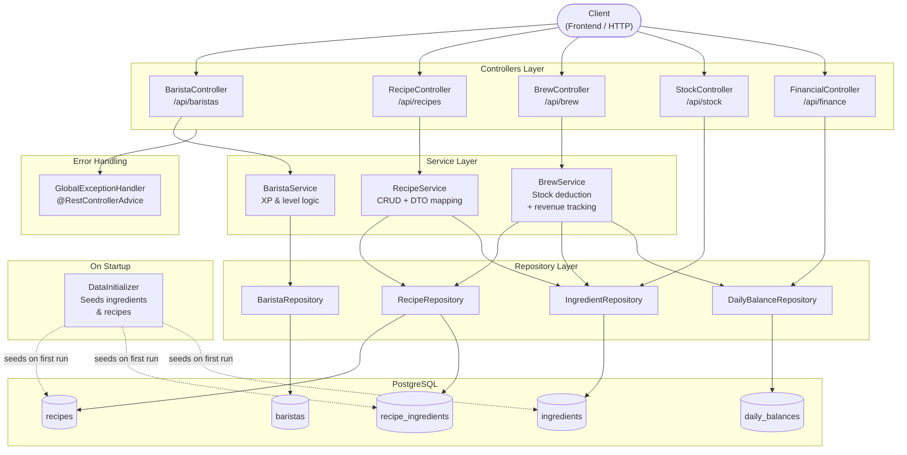

# BrewStack — Coffee Management API

A REST API for managing a coffee shop. Handles recipes, ingredients, baristas with an XP progression system, and daily financial tracking.

Built with **Java 17**, **Spring Boot 3.2**, and **PostgreSQL**.

---

## Features

- **Recipes** — list drinks, update name/price/XP reward, delete
- **Stock** — track ingredient quantities and low-stock alerts
- **Brew** — process a drink order: deducts ingredients and records revenue
- **Baristas** — create baristas, award XP through a rating system, level up automatically
- **Finance** — daily revenue and order count, full history sorted by most recent

---

## Architecture



---

## Requirements

- Java 17+
- Maven 3.8+
- Docker (for the database)

---

## Running the project

### 1. Clone the repository

```bash
git clone git@github.com:sgodoy0306/coffee-management-api.git
cd coffee-management-api
```

### 2. Start the database

```bash
make db
```

This starts a PostgreSQL 16 container on port `4040` with the following config:


| Setting  | Value          |
| -------- | -------------- |
| Database | `coffeedb`     |
| User     | `brewstack`    |
| Password | `brewstack123` |
| Port     | `4040`         |


### 3. Run the application

```bash
make run
```

The API will start on **[http://localhost:8181](http://localhost:8181)**.

On first run, `DataInitializer` automatically seeds the database with 7 ingredients and 7 recipes.

### One-command setup (build + test + run)

```bash
make all
```

This runs: `db → compile → test → package → run` in sequence.

---

## Available Makefile commands


| Command        | Description                     |
| -------------- | ------------------------------- |
| `make db`      | Start the PostgreSQL container  |
| `make run`     | Run the Spring Boot application |
| `make compile` | Compile source code             |
| `make test`    | Run tests                       |
| `make package` | Build JAR (skips tests)         |
| `make stop`    | Stop the database container     |
| `make clean`   | Remove compiled artifacts       |
| `make all`     | Full build and run pipeline     |


---

## API Endpoints

### Recipes — `/api/recipes`


| Method   | Path                | Description        | Body                                                 |
| -------- | ------------------- | ------------------ | ---------------------------------------------------- |
| `GET`    | `/api/recipes`      | List all recipes   | —                                                    |
| `GET`    | `/api/recipes/{id}` | Get a recipe by ID | —                                                    |
| `POST`   | `/api/recipes`      | Create a recipe    | `{ "name", "baseXpReward", "price", "ingredients" }` |
| `PUT`    | `/api/recipes/{id}` | Update a recipe    | `{ "name", "baseXpReward", "price" }`                |
| `DELETE` | `/api/recipes/{id}` | Delete a recipe    | —                                                    |


**GET /api/recipes response example:**

```json
[
  {
    "id": 1,
    "name": "Latte",
    "baseXpReward": 25,
    "price": 5.50,
    "ingredients": [
      { "ingredientName": "Espresso Beans", "unit": "grams", "quantityRequired": 18.0 },
      { "ingredientName": "Whole Milk",     "unit": "ml",    "quantityRequired": 200.0 }
    ]
  }
]
```

**POST /api/recipes request example:**

```json
{
  "name": "Vanilla Latte",
  "baseXpReward": 30,
  "price": 6.00,
  "ingredients": [
    { "ingredientName": "Espresso Beans", "quantity": 18.0 },
    { "ingredientName": "Whole Milk",     "quantity": 200.0 }
  ]
}
```

Returns `404` if any ingredient name does not exist in the database.

---

### Baristas — `/api/baristas`


| Method   | Path                          | Description            | Body           |
| -------- | ----------------------------- | ---------------------- | -------------- |
| `GET`    | `/api/baristas`               | List all baristas      | —              |
| `GET`    | `/api/baristas/{id}`          | Get a barista by ID    | —              |
| `POST`   | `/api/baristas`               | Create a barista       | `{ "name" }`   |
| `PUT`    | `/api/baristas/{id}`          | Rename a barista       | `{ "name" }`   |
| `DELETE` | `/api/baristas/{id}`          | Delete a barista       | —              |
| `POST`   | `/api/baristas/{id}/practice` | Award XP (rating 1–10) | `{ "rating" }` |


**XP & leveling:** each practice session grants `rating × 50` XP. Level is calculated as `floor(sqrt(totalXp / 100)) + 1`.

---

### Brew — `/api/brew`


| Method | Path                   | Description                                                       | Body                              |
| ------ | ---------------------- | ----------------------------------------------------------------- | --------------------------------- |
| `POST` | `/api/brew/{recipeId}` | Process a single brew: deducts stock and records revenue          | —                                 |
| `POST` | `/api/brew/order`      | Process a multi-recipe order and award XP to the assigned barista | `{ "recipeIds", "baristaId" }`    |


Returns `400` if any ingredient has insufficient stock.

**POST /api/brew/order request example:**

```json
{
  "recipeIds": [1, 3, 5],
  "baristaId": 2
}
```

**POST /api/brew/order response example:**

```json
{
  "baristaXp": 350,
  "baristaLevel": 2,
  "totalRevenue": 17.00,
  "totalOrders": 3
}
```

Stock is validated for all recipes atomically before any deduction. The barista is awarded XP equal to the sum of each recipe's `baseXpReward`.

---

### Stock — `/api/stock`


| Method   | Path                      | Description                            | Body               |
| -------- | ------------------------- | -------------------------------------- | ------------------ |
| `GET`    | `/api/stock`              | List all ingredients and stock levels  | —                  |
| `PATCH`  | `/api/stock/{id}/restock` | Add stock to an ingredient by ID       | `{ "amount" }`     |


**PATCH /api/stock/{id}/restock request example:**

```json
{
  "amount": 500.0
}
```

Returns `404` if the ingredient is not found.


---

### Finance — `/api/finance`


| Method | Path                        | Description                                     |
| ------ | --------------------------- | ----------------------------------------------- |
| `GET`  | `/api/finance/daily-report` | Today's total revenue and order count           |
| `GET`  | `/api/finance/history`      | All days with revenue, sorted most recent first |


**Daily report response example:**

```json
{
  "date": "2026-03-08",
  "totalRevenue": 17500.00,
  "totalOrders": 5
}
```

---

## Error responses

All errors return a consistent JSON shape:

```json
{
  "status": 404,
  "error": "Recipe Not Found",
  "message": "Recipe not found with id: 99",
  "timestamp": "2026-03-08T14:30:00"
}
```


| Status | Cause                                      |
| ------ | ------------------------------------------ |
| `400`  | Insufficient stock or invalid request body |
| `404`  | Barista, recipe, or ingredient not found   |
| `500`  | Unexpected server error                    |


---

## Seeded data

On startup the following data is created if not already present:

**Ingredients:** Espresso Beans, Whole Milk, Matcha Powder, Chocolate Powder, Oat Milk, Water, Ice

**Recipes:**


| Name           | Price | XP  |
| -------------- | ----- | --- |
| Espresso       | $3.50 | 10  |
| Latte          | $5.50 | 25  |
| Flat White     | $5.00 | 30  |
| Cappuccino     | $5.00 | 25  |
| Matcha Latte   | $6.50 | 35  |
| Mocha          | $6.00 | 30  |
| Iced Americano | $4.50 | 15  |


---

## Tech stack


| Layer       | Technology                          |
| ----------- | ----------------------------------- |
| Language    | Java 17                             |
| Framework   | Spring Boot 3.2                     |
| Database    | PostgreSQL 16                       |
| ORM         | Spring Data JPA / Hibernate         |
| Validation  | Spring Validation (Bean Validation) |
| Boilerplate | Lombok                              |
| Build       | Maven                               |
| DB runtime  | Docker                              |


